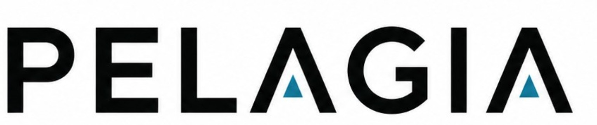

<p align="center">
  
</p>

# Pelagia

Pelagia is a scalable image-analysis system for extracting, segmenting, organizing, labeling, and training models on biological image data. It is built around video-frame ingestion, ROI-first processing, durable metadata, background workers, and reproducible data products.

<p align="center">
  
</p>

Pelagia is designed for workflows where full source frames are large and mostly cold, while segmented ROIs are the primary unit of analysis. Full-frame payloads can live in external cold storage, while ROI crops, masks, measurements, classifications, and curation state remain close to the database-backed analysis workflow.

## System Architecture

Pelagia keeps interface code thin and moves reusable behavior into shared services and processing modules.

```text
API / CLI / Workers
        |
        v
     Services
        |
        +--> Storage adapters
        |      - Postgres metadata, queue, worker sessions, events
        |      - Cold payload storage for large frame data
        |
        +--> Processing routines
               - frame extraction
               - segmentation
               - ROI storage
               - correction, encoding, and analysis helpers
```

The repository layout follows that split:

```text
Pelagia/
  config.py              typed config loaded from TOML/env/CLI overrides
  domain.py              stable records, enums, and row models
  storage/               persistence adapters and SQL schema resources
  processing/            image and model processing routines
  services/              application workflows shared by interfaces
  workers/               job claiming, dispatch, heartbeat, and execution
  api/                   FastAPI application and route modules
  cli/                   command-line entrypoint and commands
  utils/                 small shared helpers
docs/assets/             documentation images and branding assets
```

## Core Capabilities

Current and planned capabilities are organized around an ROI-centered pipeline:

- **Video and image ingestion**: register source assets, extract frames, store full-frame payloads in cold storage, and record searchable metadata.
- **Frame correction**: apply image normalization such as flatfield correction before storage or analysis.
- **Segmentation**: detect candidate ROIs from extracted frames, store ROI crops, masks, geometry, and image statistics.
- **Segmentation refinement**: support learned mask refinement models such as U-Net-style models for better ROI boundaries.
- **Labeling and classification**: attach model predictions and human labels to ROIs using CNN-style classifiers or related image models.
- **Clustering and exploration**: support unsupervised grouping with embeddings, PCA, k-means, and related tools for dataset discovery.
- **Training set curation**: refine labels, identify uncertain examples, manage balanced training sets, and track curation decisions.
- **Model training and evaluation**: train, register, compare, and archive segmentation and classification models.
- **Export**: produce robust exports for ROIs, masks, labels, measurements, embeddings, model outputs, and curated datasets.
- **Scalability**: run independent worker processes per job type, scale across CPU cores or machines, and keep a durable job/event history.

## Data Model

Pelagia separates runtime image data from persistent row models:

- `FrameData` is the runtime container for image arrays, masks, geometry, and source metadata while processing.
- `FrameRecord` is the database row model for a stored frame, including geometry and a payload reference for large frame data.
- `DetectionRecord` is the database row model for an ROI, including object bounds, padded crop bounds, ROI payload, mask payload, and measurements.
- `raw_assets.collections` is a first-class grouping field assigned at ingestion. Values can be provided as a comma-separated string or list, are normalized into a non-empty array, and default to `none` when unspecified.

This keeps the boundary clear: large source frames can remain cold and only be fetched when needed, while compact ROI-centered data stays available for analysis and curation.

## Jobs And Workers

Pelagia uses Postgres-backed jobs to coordinate long-running processing. Workers are independent processes that claim jobs for specific stages, heartbeat while active, write job events, and can be stopped through worker-session state.

Example worker roles:

```text
extract_frames workers     video/image frame extraction
segment workers            ROI detection and mask generation
classify workers           ROI labeling with trained models
curation workers           embedding, clustering, and dataset refinement tasks
export workers             dataset/model/result export tasks
training workers           model training and evaluation jobs
```

This architecture allows the system to grow from one local process to many specialized background daemons without changing the shape of the pipeline.

## FastAPI Interface

The v0 API exposes the same core workflows as the CLI and workers:

```bash
uvicorn Pelagia.api.app:create_app --factory --host 127.0.0.1 --port 8000
```

Useful endpoint groups:

- `GET /health`, `/health/postgres`, `/health/kvstore`
- `GET /system`, `/system/status`, `/system/use`
- `POST /system/initialize`
- `POST /ingestion/videos`
- `POST /segmentation/frames/{frame_id}`
- `GET /jobs`, `POST /jobs`, `GET /jobs/events`
- `POST /jobs/{job_id}/pause`, `/resume`, `/retry`, `/priority`
- `GET /workers`, `POST /workers/{worker_id}/shutdown`
- `GET /runs`, `/assets`, `/models`, `/kvstore/status`
- `GET /collections`, `GET /assets?collection=test`, `GET /runs?collection=test`

General list endpoints are intentionally shaped as limited searches. For example,
`GET /assets` does not require a run id and can be narrowed with filters such as
`collection`, `kind`, `asset_key`, `path`, `checksum`, size bounds, and `limit`.
Frame metadata can be searched by range with
`GET /assets/{asset_id}/frames?start_frame=1&end_frame=100`, and frame image data
can be loaded with `GET /assets/{asset_id}/framedata/{frame_num}?format=png`.
Supported frame data formats are `png`, `jpg`/`jpeg`, `matrix`, and `preview`.
Preview requests return a small PNG placeholder and accept `preview_max_dim`, for example
`GET /assets/{asset_id}/framedata/{frame_num}?format=preview&preview_max_dim=128`.

## Configuration

Pelagia loads configuration in this order:

```text
Pelagia/default.config.toml < ./config.toml < environment variables < explicit CLI options
```

The packaged [default.config.toml](Pelagia/default.config.toml) contains development-friendly defaults. Create a local `config.toml` in the repository root for machine-specific overrides; it is ignored by git.

## Storage Strategy

Pelagia treats storage as a replaceable adapter layer.

- Postgres stores durable metadata, jobs, worker sessions, events, frame records, ROI records, model records, and classification results.
- Large full-frame payloads are stored by a cold payload store adapter because they are expensive and usually read infrequently.
- ROI crops and masks are small enough to store directly with ROI records, making downstream analysis and export simpler.

`KVStore` is currently the cold payload store used by Pelagia during development. It is intentionally separable and is expected to become an external dependency rather than a core Pelagia subsystem.

## Development Direction

The near-term goal is to keep Pelagia small at the interfaces and strong in the pipeline core:

- keep API, CLI, and worker entrypoints thin;
- keep processing routines focused and testable;
- keep row models aligned one-to-one with database records;
- keep storage adapters replaceable;
- keep job history explicit through `job_events`;
- build curation, training, and export features on top of the same ROI-centered data model.
